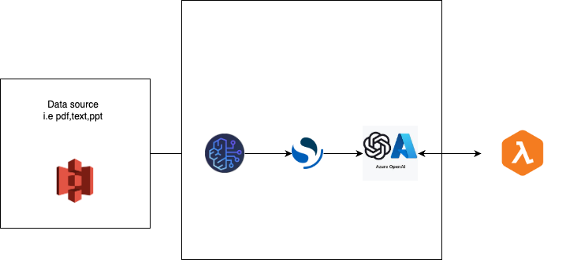

# RAG-using-AWS-Bedrock-and-Azure-OpenAI

### To install all libararies

```sh
python3 -m venv myenv
```

```sh
source myenv/bin/activate
```

```sh
pip install -r requirements.txt
```

```sh
pip install --upgrade pip
```


### To Run FASTAPI

```uvicorn main:app --reload
```


# Detail Architecture:

### AWS Services Use:
1. AWS Bedrock
2. AWS S3 - source
3. AWS Bedrock, Vector database (opensearch serverless) 
4. AzureOpenAI API
5. FastAPI

### Architecture Diagram




